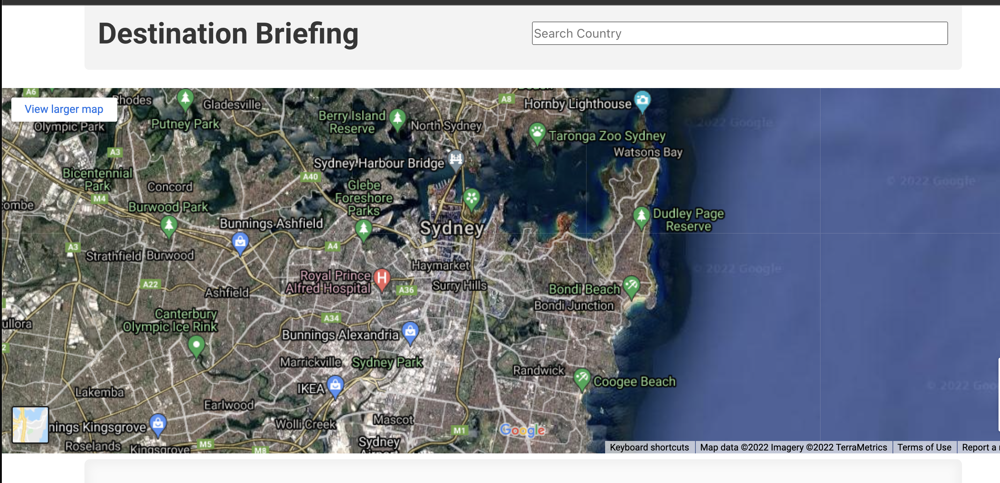

# Destination Briefing
This project is part of the University of Minnesota Full Stack Web Development Curriculum and is a collaborative project.  The project tasked our team with creating an app with some fundamental techinical requirements but the ***"WHAT & HOW"*** of the project was for the team to decide. 

## The Project:
We created an app that gathers valuable country specific travel information that is spread out over many locations and present it to the user in one simple to navigate graphically clean location. 

A user simply has to inquiry by country and the app obtains and displays important travel information in regards to time, current and historical weather conditions as well as currency, electric information and Health Safety needs.  This information is realtime and is being gather from multiple servers so information will update with each refresh.  Also we integrated Google Maps to display the desired country on the map with links for direction searches as well as the Google Maps satellite imagery feature. 

## Using the App:

### Simply enter the desired Country of inquiry
-A list will be presented that shows all available options.  The list will respond to inputs helping with spelling and country selection.

## The Map will move to the selected Country
-Options for satelite imagery and links for directions are present. 

## Cards Populate with Current Time and Weather Conditions
-All informating is presented from a LIVE API and will update for accuracy.

## Other Important Travel info loads in Cards below
-The App also displays currency used, currency conversions, voltages, plug types with display icons and health information including water safety and vaccination needs.

## How it Works:

At page load the country list is gathered and stored in local storage making searching for countries much easier for the user. It gathers information from two Server-side APIs that are fetched when the desired country is searched. The App gathers data from those fullfilled requests and dynamically creates elements through JavaScript into the HTML. Then using Bulma we display the info on easy to understand graphically clean and polished interface. Also the App has incorporated a few different sources of SVG files to give the program visual appeal but also scales well with different screen sizes. Since the App utilies Bulma all the of the display is in Flexbox so moblie friendly.  

For more indepth information on the functionality see the following:

***-The Map:*** 
The map function of the app is supported by Google Maps.  Once a country is selected it is feed into the map function and the map displays the current Google Map information of the country. The feature is zoomable and scrollable  Also, the legend displays latitude and longitude, there is an option for satellite imagery and a link for finding directions is present.  

***-Current Time:*** 
The country specific time is found through Moment JS and through some JavaScript logic we present the current time with the difference of the country searched for the user.

***-Current Weather:*** 
The data is gathered from FCC-Weather API then dynamically presented through JavaScript to the HTML.  We also intergated annimated WX Icons to give the data some style and appear.

***-Average Monthly Temperatures:*** 
The data is gathered from FCC-Weather API then presented dynamically through JavaScript with some logic that allows a colorize snapshoot of the monthly weather.

***-Currency and Language:*** 
The data is gathered from Travel Briefing API then dynamically created.  We incorporated some logic to display the exchange rate from one USD.

***-Electricity Info:*** 
The data is gathered from Travel Briefing API then dynamically created and presented.  Also added logic that presents correct plug type with a SVG icon. 

***-Health Info:*** 
The data is gathered from Travel Briefing API then dynamically created and presented.  Both water information as well as vaccine needs are presented.  

***-Display itself:*** 
Each HTML element we used is given Bulma clases so it responses well to different screen sizes.  We took care to make sure all the graphics are vectors so they would be displayed well on different monitor sizes.  

## Project Requirements:
- Intergrating Information from Multiple Server-side APIs:  
    We used FCC Weather API and Travel Briefing API.

- Alternate CSS Framwork other than Bootstrap:   
    We intergrated Bulma Framework into the UI.

- Client-Side Storage for Persistent Data:  
    In the search catergory all the the countries are saved in local storage which makes searching countries quicker and much easier from a UI perspective.

- Polished UI:  
    UI runs smoothly and requires no explanation to operate.  Most valuable data presented upfront followed but other usefuls information displayed below.  The UI scales well to each display sizes.  All our graphics are vectors and respond well to size changes. 

- Meet good coding standards:  
    Code is Dry, has comments for descriptions, use of intendentations and is organized.

- Must NOT use alerts, confirms or prompts:  
    None present.   Modal alerts are used for network connection issues informing the user of any issues. 

- Must be deployed on GitHub Pages:  
    <a href="https://pjlawler.github.io/destination-briefing/">Destination Briefing Page</a>

- Must be interactive:  
    The app works begins with the user interacting by entering a country search. Also the Google Maps feature is interactive: scrollable, zoomable.  Present are links for Satellite imagery and links for directions.  

## The Team:
This project was created by:
- Pat Lawler
- Lawrence Jones
- Paul Gottinger
- Daniel Putman

## Resources:
Google Maps:
<a href="https://mapsplatform.google.com/maps-products/#dynamic-maps">Google Maps </a>

APIs Used:  
<a href="https://travelbriefing.org/api">Travel Briefing API</a>  
<a href="https://fcc-weather-api.glitch.me/"> FCC-Weather-API</a> 

CSS Framework: 
<a href="https://bulma.io/"> Bulma Framework</a>

Project Repo: 
<a href="https://github.com/pjlawler/destination-briefing">Destination Briefing Repo</a>

Time Keeping Program:  
<a href="https://momentjs.com/">Moment JS</a>

Annitmated WX Icons: 
<a href="https://github.com/basmilius/weather-icons"> Icons Repo Link </a> -Copyright (c) 2020-2022 Bas Millius <a href="https://github.com/basmilius/weather-icons/blob/dev/LICENSE">See this Link for License Info</a>

Plug Type Icons:
<a href="https://www.shutterstock.com/image-illustration/electric-outlet-illustration-on-white-background-524251816">Shutterstock.com</a>

