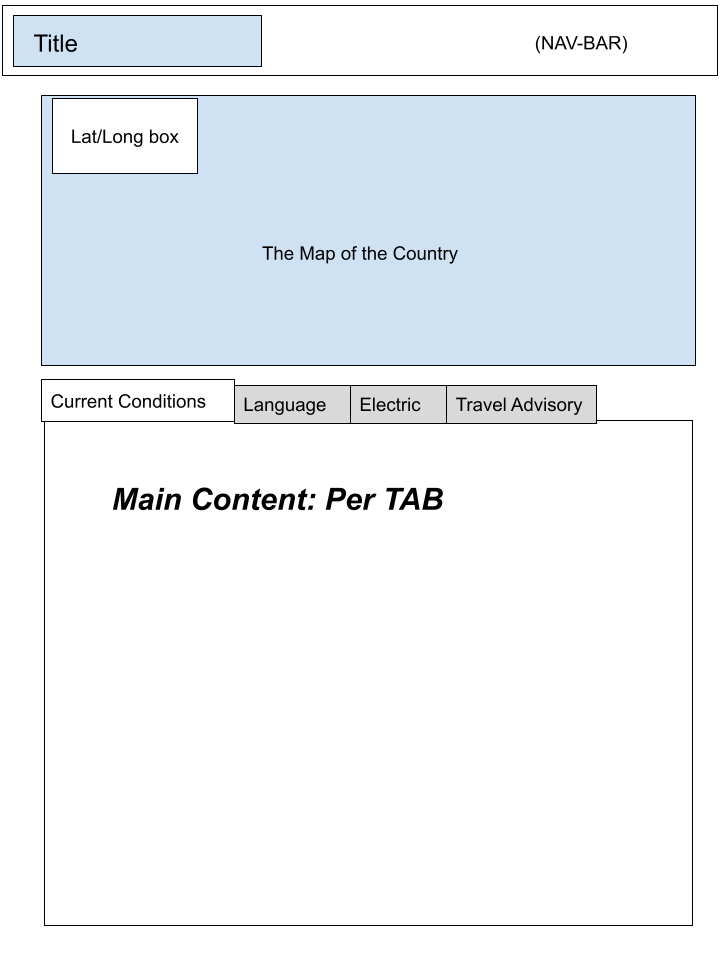
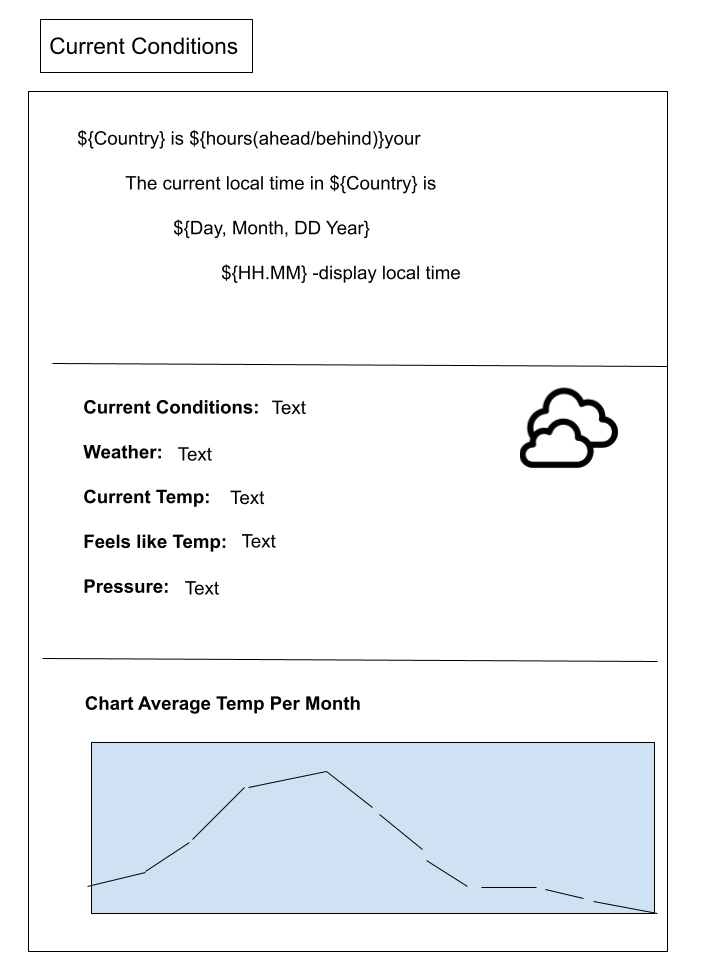
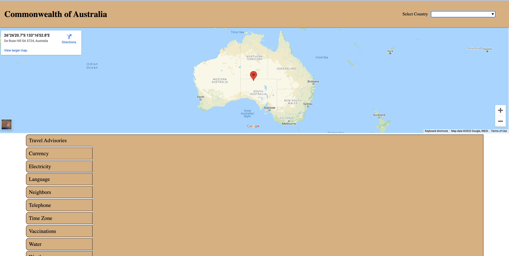

# Destination Briefing

This project is part of the University of Minnesota Full Stack Web Development Curriculum and is a collabertive project.  The project tasked the team with creating an app with some base project requirements but the ***"WHAT"*** of the project was for the group to decide. 

## The Project:

We created an app that would gather valueable travel information that is spread out over many locations about a given country and present it to the user in one simple to navigate location. 

A user would simply search by entering the country name and the app would gather and populate desired travel information such as current time, weather patterns, currency, language, electrical information and other valueable travel information giving them a destination briefing.

## How it Works:
It gether information from two Server-side APIs(unfinished)

Since the country names are stored in Local Storage it lists out all possible countries. Also as the user types in their country it auto eleminates countries by spelling making selection easier.

## Project Requirements:
- Intergrating Information from Multiple Server-side APIs:  
    We used FCC Weather API and Travel Briefing API

- Alternate CSS Framwork other than Bootstrap:   
    We intergrated Bulma Framework into the UI.

- Client-Side Storage for Persistent Data:  
    In the search catergory all the the countries are saved in local storage which makes searching countries quicker and much easier from a UI perspective.

- Polished UI:  
    UI runs smoothly and requires no explanation to operate.  Most valuable data presented upfront followed but other usefuls nested in tabs.

- Meet good coding standards:  
    Code is Dry, has comments for descriptions, use of intendentations.

- Must NOT use alerts, confirms or prompts:  
    None present.  Useful <console.logs> are present for interested users.  

- Must be deployed on GitHub Pages:  
    Coming soon...  

- Must be interactive:  
    The app works begins with the user interacting by country search.  Then information is present upfront with other infomration nested in tabs.

## The Team:
This project was created by:
- Pat Lawler
- Lawrence Jones
- Paul Gottinger
- Daniel Putman

## Resources:
APIs Used:  
<a href="https://travelbriefing.org/api">Travel Briefing API</a>  
<a href="https://fcc-weather-api.glitch.me/"> FCC-Weather-API</a> --? 

CSS Framework:  
<a href="https://bulma.io/"> Bulma Framework

Project Repo:  
<a href="https://github.com/pjlawler/destination-briefing">Destination Briefing Repo</a>

## Images/Development:

Wireframe Drawings for Refinement:  
 

Original Mockup of App:
  

