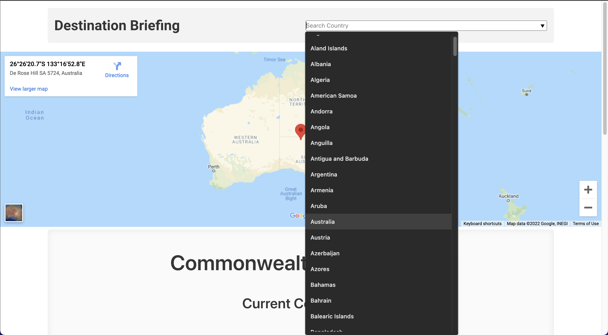
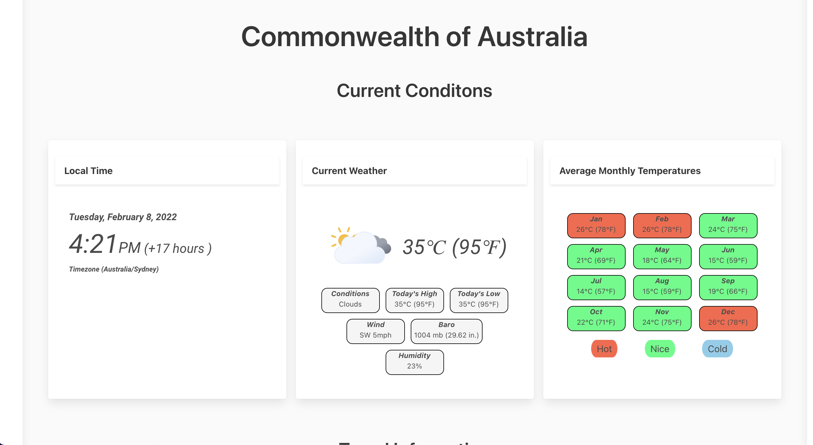
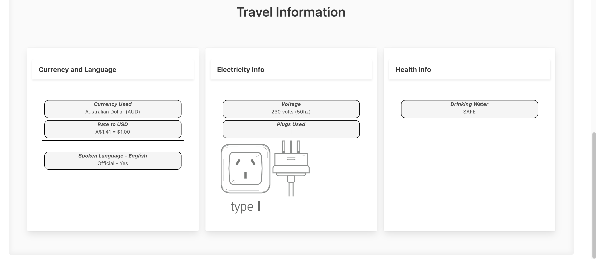

# Destination Briefing
This project is part of the University of Minnesota Full Stack Web Development Curriculum and is a collabertive project.  The project tasked the our team with creating an app with some foundimental techincal requirements but the ***"WHAT & HOW"*** of the project was for the team to decide. 

## The Project:
We created an app that gathers valueable travel information that is spread out over many locations about a given country and present it to the user in one simple to navigate location. 

A user simply has to search by country name and the app gathers and populates important travel information in regards to time, current and historical weather conditions as well as currency, eletric information and Health Safety info are displayed.  This information is realtime and is being gather from multiple servers so information will update with each refresh.  Lastly we intergrated Google Maps to display the desired country on the map.

## How it Works:

At page load the country list is gather and stored in local storage making searching for country much easier for the user. It gathers information from two Server-side APIs that are fetched when the desired country is searched. Then it gathers data from those requests and dynamically creates elements through JavaScript into the HTML. Then using BULMA we display the info on easy to understand graphically clean and polished cards. Also we have incorperated a few different sources of SVG files to give the program visual appear but also works well with different screen sizes. The display responses well to all screen sizes because each element is based on Flexbox.  

For more indept information on the functionality see the following:

***-Current Time:*** 
The country specific time is found through Moment JS and some JavaScript logic we present the current time and the different either ahead or behind for the user.

***-Current Weather:*** 
Data is gathered from FCC-Weather API then dynamically presented through JavaScript to the HTML.  We also intergated annimated WX Icons to give the data some style and appear.

***-Average Monthly Temperatures:*** 
Data is gathered rom FCC-Weather API then presented dynamically through JavaScript with some logic that gives colored Give the HOT/NICE/COLD color/temp map.  

***-Currency and Language:*** 
Data is gathered from Travel Briefing API then dynamically created.  We corperated some logic to display the exchange rate from one USD.

***-Electricity Info:*** 
Data is gathered from Travel Briefing API then dynamically created and presented.  Also added logic that presents correct plug type with a SVG icon. 

***-Health Info:*** 
Data is gathered from Travel Briefing API then dynamically created and presented.

***-Display itself:*** 
Each HTML element we used is given Bulma clasess so it responses well to different screen sizes.  We took care to make sure all the graphics we displayed would respond well to different monitor sizes.  

## Project Requirements:
- Intergrating Information from Multiple Server-side APIs:  
    We used FCC Weather API and Travel Briefing API.

- Alternate CSS Framwork other than Bootstrap:   
    We intergrated Bulma Framework into the UI.

- Client-Side Storage for Persistent Data:  
    In the search catergory all the the countries are saved in local storage which makes searching countries quicker and much easier from a UI perspective.

- Polished UI:  
    UI runs smoothly and requires no explanation to operate.  Most valuable data presented upfront followed but other usefuls information displayed below.  The UI scales well to each display size and incorperates all SVG elements so images scale well as they shrink or grow.  Clean and sizes well.  

- Meet good coding standards:  
    Code is Dry, has comments for descriptions, use of intendentations and is organized.

- Must NOT use alerts, confirms or prompts:  
    None present.  Useful <console.logs> are present for interested users.  Modal alerts are used for network connection issues. 

- Must be deployed on GitHub Pages:  
    Coming soon...  

- Must be interactive:  
    The app works begins with the user interacting by country search. 

## The Team:
This project was created by:
- Pat Lawler
- Lawrence Jones
- Paul Gottinger
- Daniel Putman

## Resources:
Google Maps:
<a href="https://mapsplatform.google.com/maps-products/#dynamic-maps">Google Maps </a>

APIs Used:  
<a href="https://travelbriefing.org/api">Travel Briefing API</a>  
<a href="https://fcc-weather-api.glitch.me/"> FCC-Weather-API</a> 

CSS Framework: 
<a href="https://bulma.io/"> Bulma Framework</a>

Project Repo: 
<a href="https://github.com/pjlawler/destination-briefing">Destination Briefing Repo</a>

Time Keeping Program:  
<a href="https://momentjs.com/">Moment JS</a>

Annitmated WX Icons: 
<a href="https://github.com/basmilius/weather-icons"> Icons Repo Link </a> -Copyright (c) 2020-2022 Bas Millius <a href="https://github.com/basmilius/weather-icons/blob/dev/LICENSE">See this Link for License Info</a>

Plug Type Icons:
<a href="https://www.shutterstock.com/image-illustration/electric-outlet-illustration-on-white-background-524251816">Shutterstock.com</a>

## Images/Development:
Working App:
Searching by Country.  List populated by Local Storage

All informating is presented from LIVE API and updates

Wireframe Drawings for Refinement:  
 

Original Mockup of App:
  

